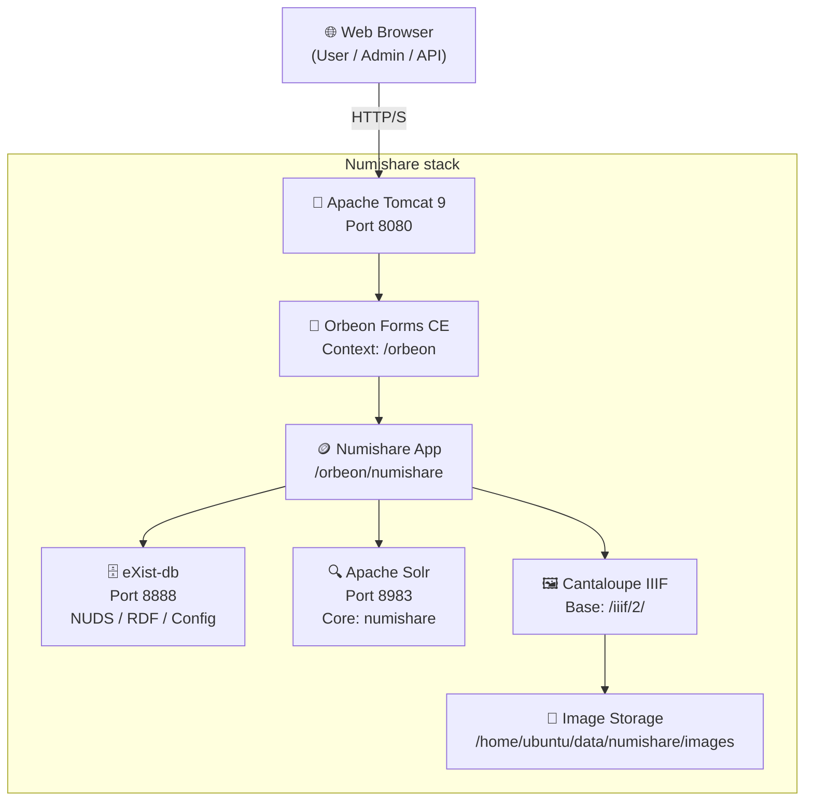

# Pile logicielle<no value>

Les applications de l'Iramat (<https://iramat-apps.cnrs.fr/>) décrites sur ce site web sont hebergées sur un [serveur web](#serveur)

## GitHub

Le site web, ainsi que des données de référence, les présentations Quarto, les discussions, etc. sont hébergées sur le GitHub de l'IRAMAT: <https://github.com/iramat>

### Site web

Les données de ce site web, développé en Hugo, sont hébergées ici: <https://github.com/iramat/iramat-apps/tree/hugo-files/content>.

## Serveur
> _server_, _Virtual Machine_, VM

Instance Ubuntu 22.04 LTS hébergée au [Mésocentre](https://mesocentre.universite-paris-saclay.fr/) de l'Université Paris-Saclay

### Bases de données

#### CHIPS

La VM héberge une système de gestion de base de données (SGBD) PostgreSQL/Postgis v17.5. Ce SGBD héberge la base de données (BDD) CHIPS, présentée dans le [site web dédié](https://iramat.github.io/chips/)

#### Instance Numishare

La VM héberge une instance Numishare (voir [documentation](https://iramat.github.io/iramat-dev/talks/2026-almacir-preparatory-meeting/pres/#/numishare))

##### Modèle conceptuel de données

Le Modèle conceptuel de données (MCD) de l'instance Numishare[^1] est le suivant:

[^1]: liste des projets utilisant la pile logicielle Numishare: <https://numismatics.org/resources/>

### IIIF

Le serveur web héberge un serveur d'image Cantaloupe et un _viewer_ Mirador (CDN). Des _webservices_ Flask (v3.1.1) sont installés pour faciliter la transformation des images à l'isostandard IIIF [[lien interne](https://iramat.github.io/iramat-apps/iiif/)]

### GeoServer

Le serveur web héberge un GeoServer: <https://iramat.github.io/iramat-apps/geoserver/>

## Zenodo

L'IRAMAT dispose d'une communauté Zenodo pour le dépôt des jeux de données, données de références, et de _pre prints_: <https://zenodo.org/communities/iramat>