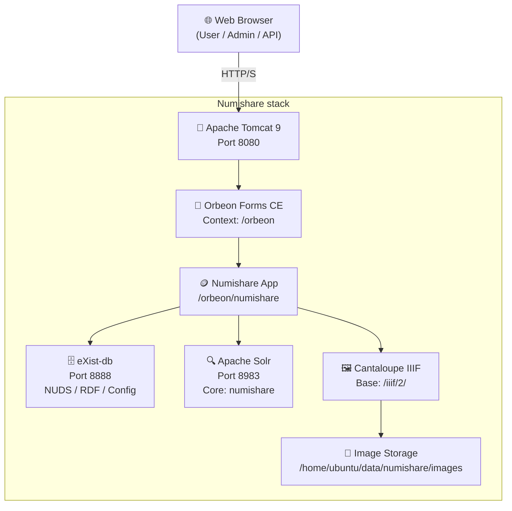

# Pile logicielle<no value>

Les applications informatiques de l'Iramat (<https://iramat-apps.cnrs.fr/>) décrites sur ce site web sont hebergées sur un [serveur web](#serveur). L'utilisation de [GitHub](#github) permet de développer un écosystème _user-friendly_ autour des données et l'entrepôt [Zenodo](#zenodo) de publier des dépôts de données facilement citables et réutilisables

## Serveur

Le serveur web[^1] est une instance Ubuntu 22.04 LTS hébergée au [Mésocentre](https://mesocentre.universite-paris-saclay.fr/) de l'Université Paris-Saclay, tutelle secondaire du LAPA-IRAMAT.

### Bases de données

Le serveur web héberge une système de gestion de base de données (SGBD) PostgreSQL/Postgis v17.5. Ce SGBD héberge notamment la base de données (BDD) [CHIPS](#chips).

#### CHIPS

Base de données CHImie en PaléoSidérurgie (CHIPS) pour le stockage et le partage de données chimiques




#### Instance Numishare

Le serveur web héberge une instance Numishare (voir [documentation](https://iramat.github.io/iramat-dev/talks/2026-almacir-preparatory-meeting/pres/#/numishare))

##### Modèle conceptuel de données

Le Modèle conceptuel de données (MCD) de l'instance Numishare[^1] est le suivant:

```mermaid
flowchart TB
    Browser["🌐 Web Browser<br/>(User / Admin / API)"]
	subgraph Numishare stack
    	Tomcat["🧱 Apache Tomcat 9<br/>Port 8080"]
    	Orbeon["📄 Orbeon Forms CE<br/>Context: /orbeon"]
    	Numishare["🪙 Numishare App<br/>/orbeon/numishare"]
   		Exist["🗄️ eXist-db<br/>Port 8888<br/>NUDS / RDF / Config"]
    	Solr["🔍 Apache Solr<br/>Port 8983<br/>Core: numishare"]
    	Cantaloupe["🖼️ Cantaloupe IIIF<br/>Base: /iiif/2/"]
    	Images["💾 Image Storage<br/>/home/ubuntu/data/numishare/images"]
	end

    Browser -->|HTTP/S| Tomcat
    Tomcat --> Orbeon
    Orbeon --> Numishare
    Numishare --> Exist
    Numishare --> Solr
    Numishare --> Cantaloupe
    Cantaloupe --> Images
```

[^1]: liste des projets utilisant la pile logicielle Numishare: <https://numismatics.org/resources/>

### Imagerie scientifique

Des _webservices_ Flask (v3.1.1) sont installés pour faciliter la transformation des images en IIIF et de visualiser des images RTI.

#### IIIF

Le serveur web héberge un serveur d'image Cantaloupe et un _viewer_ Mirador (CDN). 

#### RTI

Le serveur web héberge un visualiseur OpenLIME. 

### GeoServer

Le serveur web héberge un GeoServer pour l'information spatiale




## GitHub

Le site web, ainsi que des données de référence, les présentations Quarto, les discussions, etc. sont hébergées sur le GitHub de l'IRAMAT.




### Site web

Les données de ce site web, développé en Hugo, sont hébergées ici: <https://github.com/iramat/iramat-apps/tree/hugo-files/content>.

## Zenodo

L'IRAMAT dispose d'une communauté Zenodo pour le dépôt des jeux de données, données de références, et de _pre prints_.




[^1]: synonymes: _server_, _Virtual Machine_, VM, machine virtuelle